# Dymn Baby 👶

<p align="center">
</p>

<p align="center">
  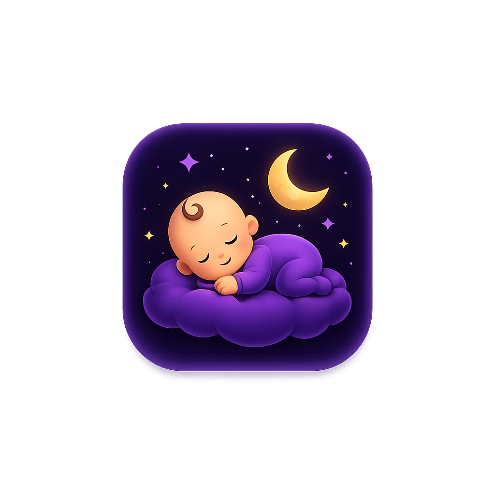
</p>

<h1 align="center">Dymn Baby</h1>

<p align="center">
A modern Android application for tracking your baby's daily routine, growth, and important milestones.
</p>

<p align="center">
  
  
  
  
  
</p>

---

## 📖 Contents

* Features
* Screenshots
* Tech Stack
* Roadmap
* Installation
* License

---

# ✨ Features

* 👶 Multiple child profiles
* 😴 Sleep tracking
* 🍼 Feeding log
* 🚶 Activity tracking
* 🚽 Toilet / diaper tracking
* 📈 Growth monitor
* 🎉 Firsts & milestones
* ❓ Questions for the pediatrician
* 🔔 Live foreground notification
* 📱 Home screen widget
* 🎨 Built-in wallpapers
* 🖼️ Custom wallpaper support
* 🌍 English & Ukrainian languages
* 💾 Fully offline
* ⚡ Fast one-tap event recording
* 📊 Daily statistics
* 📅 Monthly history
* 🎨 Customizable tile colors & transparency

---

# 📸 Screenshots

| Home                                                    | Sleep                                                | Feeding                                                |
| ------------------------------------------------------- | ---------------------------------------------------- | ------------------------------------------------------ |
| 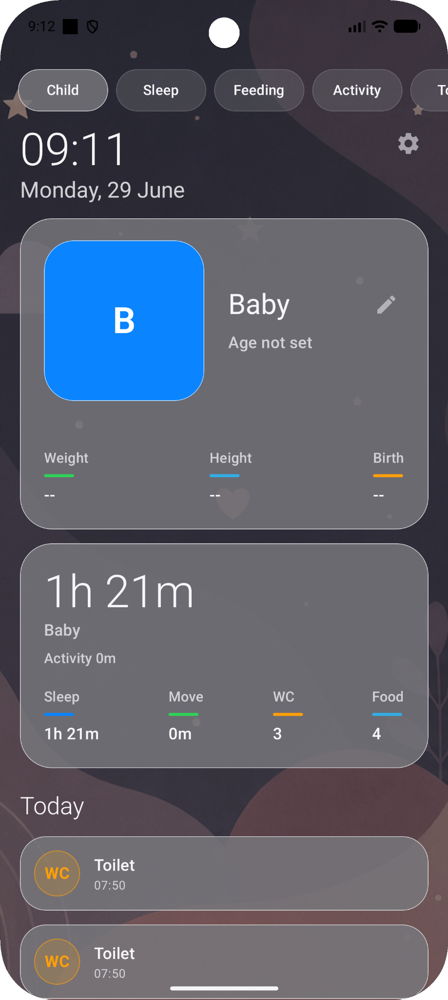 | 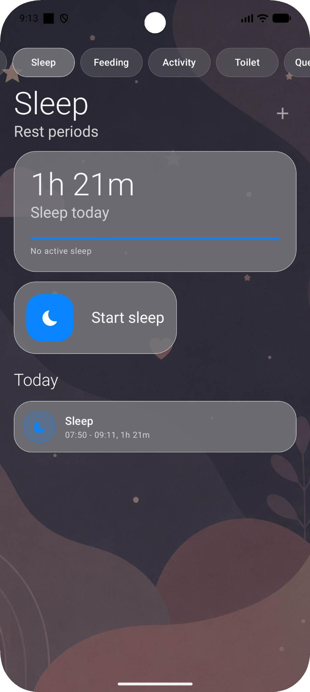 | 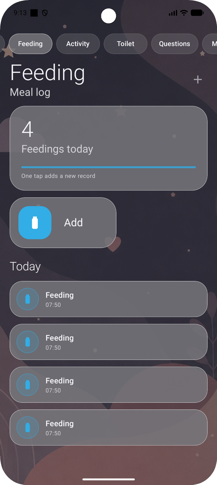 |

| Activity                                                | Toilet                                                | Questions                                                |
| ------------------------------------------------------- | ----------------------------------------------------- | -------------------------------------------------------- |
| 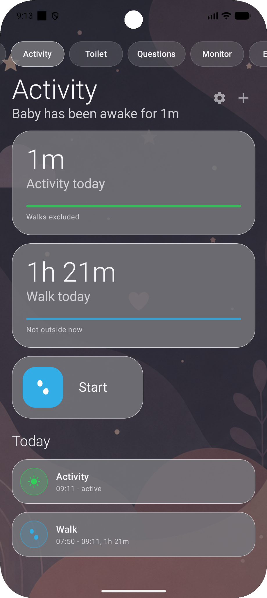 | 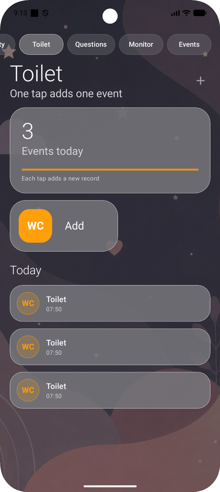 | 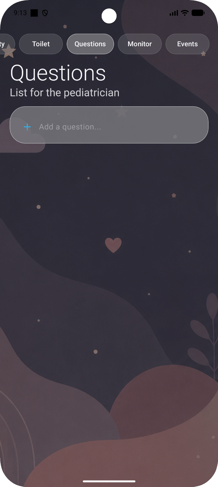 |

| Growth Monitor                                                | Events                                                    | Widget                                                |
| ------------------------------------------------------------- | --------------------------------------------------------- | ----------------------------------------------------- |
| 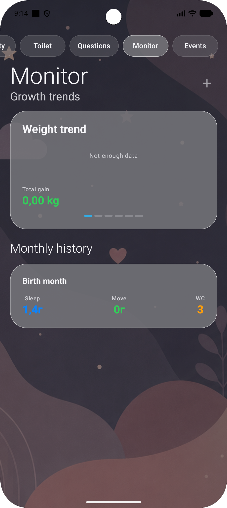 | 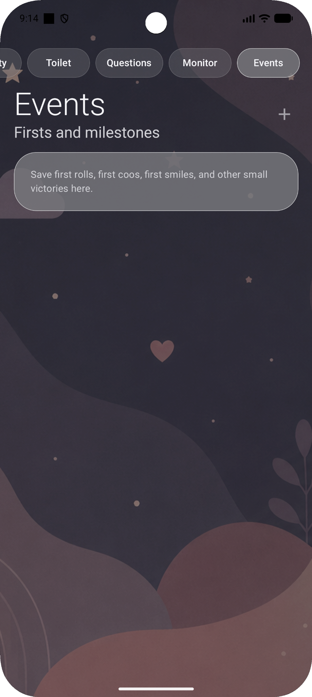 | 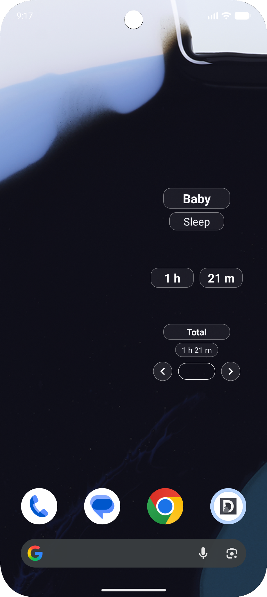 |

| Settings                                                | Child Switcher                                              | Child Details                                                |
| ------------------------------------------------------- | ----------------------------------------------------------- | ------------------------------------------------------------ |
| 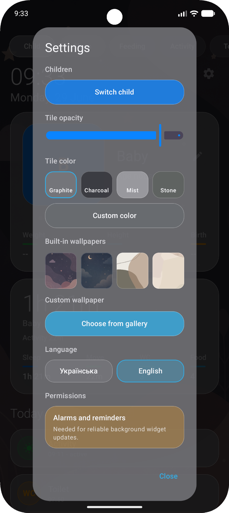 | 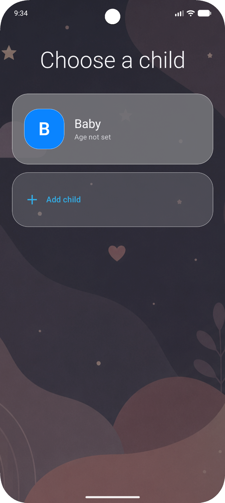 | 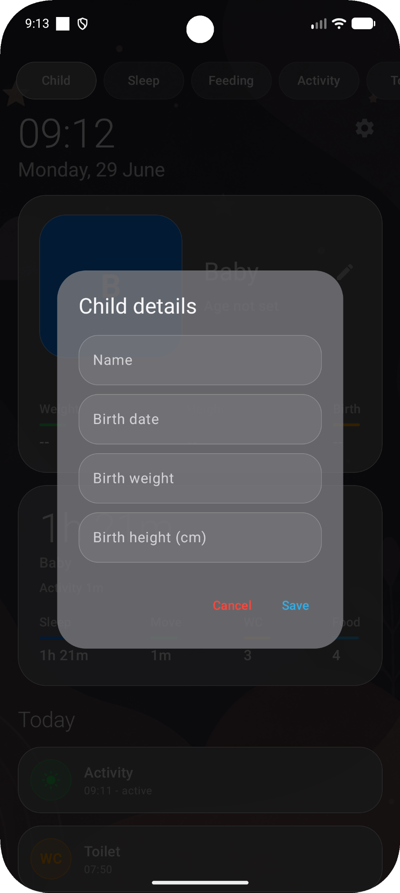 |

| Notification                                                |
| ----------------------------------------------------------- |
| 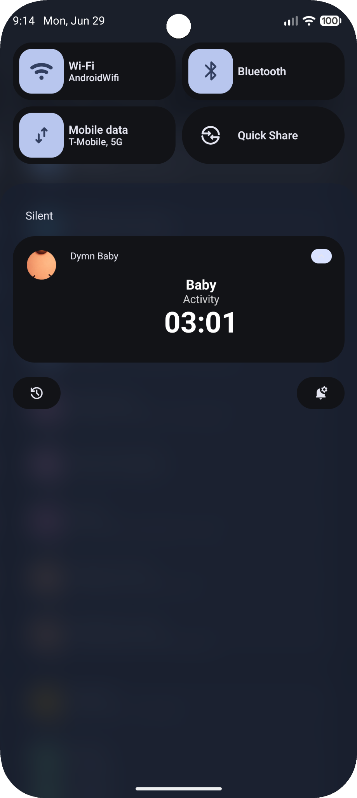 |

---

# 🛠 Tech Stack

* Kotlin
* Android SDK
* Material Design 3
* Room Database
* RecyclerView
* ViewBinding
* SharedPreferences
* Android Widgets
* Foreground Services
* Notifications

---

# 🗺 Roadmap

## ✅ Implemented

* [x] Multiple child support
* [x] Sleep tracker
* [x] Feeding tracker
* [x] Activity tracker
* [x] Toilet events
* [x] Growth monitor
* [x] Monthly history
* [x] Daily statistics
* [x] Milestones & first events
* [x] Pediatrician questions
* [x] Live notification timer
* [x] Home screen widget
* [x] Built-in wallpapers
* [x] Custom wallpapers
* [x] Language switching (EN / UA)
* [x] Tile color customization
* [x] Tile opacity customization
* [x] Offline storage

## 🚀 Planned

* [ ] Cloud synchronization
* [ ] Google Drive backup
* [ ] Charts & advanced analytics
* [ ] Data export / import
* [ ] Family sharing

---

# 📥 Installation

```bash
git clone https://github.com/DymnStudio/Dymn-Baby.git
```

Open the project with **Android Studio** and run it on any Android device or emulator.

---

# 🤝 Contributing

Contributions, ideas, and feature suggestions are welcome.

If you find a bug or have an idea for improvement, feel free to open an Issue or submit a Pull Request.

---

# 📄 License

This project is licensed under the MIT License.

---

# 👨‍💻 Developer

<p align="center">

Developed with ❤️ by **DymnStudio**

⭐ If you like this project, consider giving it a star.

</p>
